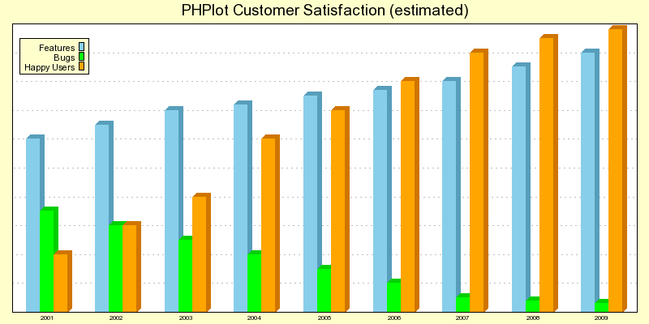

# PHPlot

## What is PHPlot?

PHPlot is a graph library for dynamic scientific, business, and stock-market charts and graphs. 
PHPlot allows PHP developers to create pie charts, bar graphs, line graphs, point graphs, etc. from a 
PHP application.

## Where do I start?

The PHPlot project page on https://github.com/PHPlot/phplot is the place to go for downloads, help, and more.

## What about documentation?

The PHPlot Reference Manual contains everything you need to know about PHPlot, and more. 
The manual is available at https://github.com/PHPlot/PHPlot/tree/master/doc/manual/main.xml
See the directory `doc/manual` for how to build the documentation and see the directory `doc/manual/examples` for examples.

There is also a [README.txt](doc/README.txt) available in the `doc` directory.

Changes are documented in [doc/NEWS.txt](doc/NEWS.txt)

## How much does it cost?

Trick question! It is completely free for you to use. You can also redistribute it unmodified without restriction. 

License: GNU Lesser General Public License, version 2.1. A copy of the license is included in [LICENSE](LICENSE)
